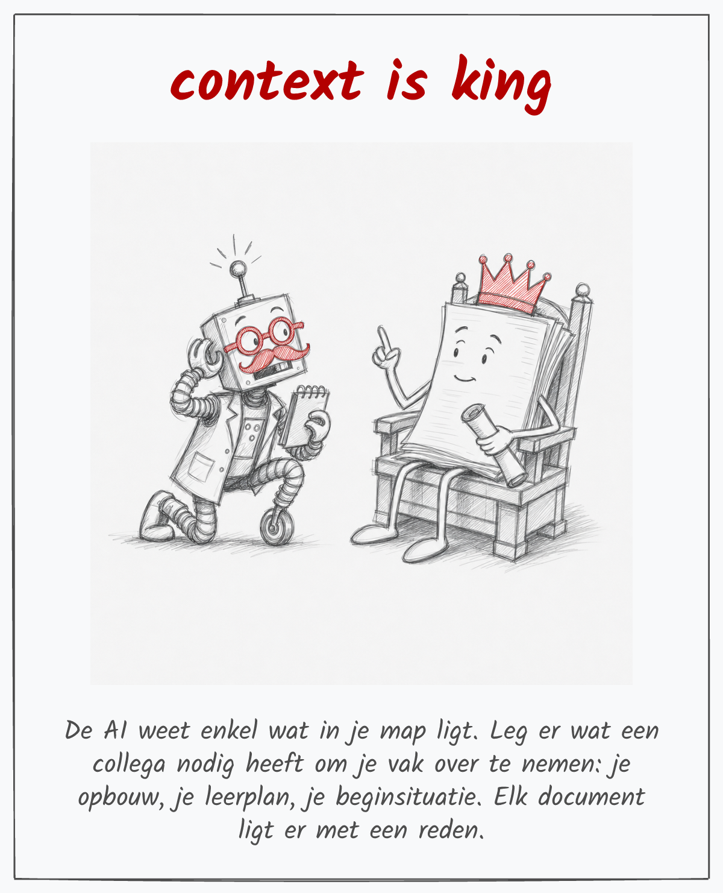

[Alle recepten voor gevorderden](index.qmd){.terug}

*Context is king*, hoor je in zowat elke talk over AI. Hieronder staat het op een kaartje, met een
robot die geknield zit te luisteren naar een stapel papier met een kroon op.

Dit recept toont wat je map nog meer kan. De AI leest dezelfde achtergrond en afspraken als voor je
hoofdstukken, en maakt er een kaartje per kernbegrip mee: bovenaan een citaat, in het midden een
tekening, eronder de les in drie zinnen. Voor je klas, voor de muur van je lokaal, of achteraan een
hoofdstuk.

{width=60%}

## Wat je nodig hebt

- je achtergrond en je afspraken uit [stap 1](../stappen/1-contextmap.qmd) en
  [stap 2](../stappen/2-regelbestand.qmd)
- een AI die beelden maakt: ChatGPT, Gemini of Copilot. Claude maakt zelf geen beelden.
- voor de tab Claude ook: VS Code, en de skill waarmee ik de kaartjes van deze site maak:
  [excalidraw-figuur (zip)](../downloads/excalidraw-figuur.zip)

## Wat je maakt

Een kaartje per kernbegrip van één hoofdstuk. Bovenaan een citaat van hoogstens vijf woorden, in het
midden een tekening zonder tekst, eronder de les. Naast elke tekening bewaar je de prompt waarmee ze
gemaakt is.

## De tekst komt er zelf bij

Toegegeven, het is verleidelijk om de beeldgenerator meteen het hele kaartje te laten maken, tekst en
al. Beeldgeneratoren maken van letters echter meestal soep, en een les van drie zinnen overleeft dat
zelden. **Laat de tekening zonder tekst maken, en zet het citaat en de les er zelf bij.** Zo lees je de
les ook na voor ze op het kaartje staat.

## Bewaar je prompt

Een tekening uit een beeldgenerator is niet opnieuw te maken. Met de prompt kom je wel in de buurt.
Zet ze in een document naast het beeld, met dezelfde naam: *contextisking* en *contextisking prompt*.

Schrijf die prompt niet zelf. De AI kent je achtergrond, en jij kiest de grap. De prompt achter de
tekening hierboven begint zo:

```{.kopieer}
A loose hand-drawn pencil sketch on off-white paper, in the style of a quick sketchbook doodle. On the left, the boxy vintage robot from the reference image kneels on one knee, antenna perked up, one pincer cupped behind its head to listen. On the right, on a simple wooden throne, sits King Context: a tall, friendly stack of paper documents wearing a crown.
```

Wil je op elk kaartje dezelfde robot, geef dan je eerste tekening mee als voorbeeld. De robot hierboven
kreeg [de tekening uit de workshop](../workshops/2026-09-14-ap-it-lectoren/assets/temmen.png) mee,
waarin de lector hem aan een rood touw meetrekt.

## Doe het nu

::: {.panel-tabset group="tool"}

## Copilot



## ChatGPT



## Gemini



## Claude



:::

## Klaar als

- [ ] je hebt de kernbegrippen van één hoofdstuk, elk met een citaat en een les
- [ ] elk kernbegrip heeft een tekening zonder tekst
- [ ] naast elke tekening staat de prompt
- [ ] je kaartjes hebben allemaal dezelfde vorm: citaat, tekening, les

## Kijk na

Lees elke les naast je hoofdstuk. Staat er een getal, een naam of een voorbeeld in dat je in de les
nooit gebruikt, vraag dan:

```{.vraag}
Uit welk document haal je de les op het kaartje over [begrip]?
```

Noemt de AI geen document, dan komt de les niet uit je map, en schrijf je ze zelf.

Bekijk daarna de tekening. Staan er toch letters in, op een blad of een bord, vraag dan een nieuwe
versie met enkel die zin erbij: *no letters on the papers*.

## Verder

Werk je met een [agent](../woordenlijst.qmd#agent) in een map op je eigen schijf, dan maakt de tab
Claude de kaartjes uit een script. De citaten en de lessen staan in één lijst. Pas je een les aan, dan
maakt het script dat kaartje opnieuw, met dezelfde tekening.

[Volgend recept: je cursus als website](cursus-als-website.qmd){.btn .btn-primary}
