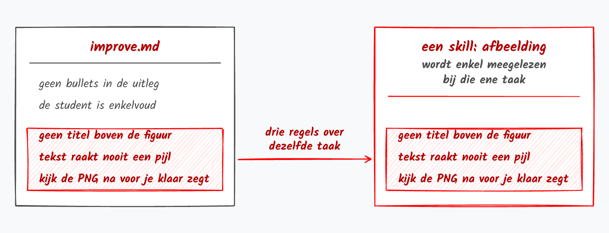

[Alle recepten voor gevorderden](index.qmd){.terug}

Op [je verbeterlijst](verbeterlijst.qmd) komen je verbeteringen als regels. Gaan er drie over dezelfde
taak, dan verhuizen ze naar hier.

## Wat je maakt

Een map *Werkwijzen* naast je Afspraken, met een document per taak die terugkomt: *Werkwijze figuren*,
*Werkwijze examenvragen*. Zo'n document heet in het Engels een **skill**. Het staat naast je Afspraken
omdat het er zelf een is: een afspraak die enkel voor één taak geldt.

::: {.mapje}
**Kansrekenen**

- **Afspraken**: hoe je wil dat er gewerkt wordt
- **Werkwijzen**: een document per taak die terugkomt
- **Cursus**: je hoofdstukken, een map per hoofdstuk
- **Achtergrond**: wat een collega nodig heeft om je vak over te nemen
:::

## Van verbeterlijst naar vaste werkwijze



Je afspraken zijn voor wat altijd geldt. Staan er op je verbeterlijst drie regels die enkel over
figuren gaan, of enkel over examenvragen, dan haal je ze eruit. Dat wordt een **vaste werkwijze**
(skill): het recept voor één taak die terugkomt.

Het moment herken je vanzelf: je hoort jezelf dezelfde uitleg dicteren, of de AI vindt telkens het
wiel opnieuw uit. Schrijf de werkwijze dan niet zelf. Vraag op het einde van het gesprek waarin de taak
net gelukt is:

```{.vraag}
Schrijf wat we net gedaan hebben als een vaste werkwijze: de stappen in volgorde, en wat er onderweg misliep. Zet er ook in welke stap ik nooit mag overslaan. Neem de regels van mijn verbeterlijst mee die over deze taak gaan.
```

Lees ze na, en zet ze in de map *Werkwijzen*. Zet er in je *Afspraken* een regel bij, onder *Waar
staat wat*:

```{.kopieer}
- Werkwijzen: een document per taak. Gaat mijn vraag over figuren, lees dan Werkwijze figuren.
```

Zo klinken de regels in een werkwijze. Deze drie komen uit de werkwijze waarmee de figuren van deze
site getekend worden:

- Staat er niet welke figuur het moet worden, vraag het dan eerst. Nooit zelf kiezen.
- Geen titel boven de figuur. Het bijschrift staat al onder de figuur in de cursus.
- Tekst overlapt nooit met de lijn van een box of met een pijl.

Online vind je hele verzamelingen skills van anderen, zie [de resources in de galerij](../galerij/resources.qmd). Installeer
ze niet allemaal. Broed op je eigen werkwijzen: die kennen jouw vak, en jij weet wat erin staat.

## Doe het nu

::: {.panel-tabset group="tool"}

## Copilot



## ChatGPT



## Gemini



## Claude



:::

## Klaar als

- [ ] staan er drie regels over dezelfde taak op je verbeterlijst: die taak heeft een werkwijze in de map Werkwijzen
- [ ] elke werkwijze heeft een regel in je Afspraken
- [ ] je AI gebruikt de werkwijze als je vraag over die taak gaat

## Kijk na

Laat een werkwijze eens een taak doen, en kijk of de stap die je nooit mag overslaan ook echt gebeurd
is. Vraag daarna:

```{.vraag}
Welke werkwijze heb je voor dit antwoord gebruikt?
```

Noemt de AI geen werkwijze, noem ze dan zelf in je vraag.

## Verder

Werk je met een [agent](../woordenlijst.qmd#agent) in een map op je eigen schijf, dan is een werkwijze
een bestand `SKILL.md` in een eigen map, en de agent haalt het er zelf bij als je vraag erover gaat.
Het recept [kennisclips en animaties](kennisclips.qmd) werkt zo.

[Volgend recept: kaartjes bij je kernbegrippen](kaartjes.qmd){.btn .btn-primary}
