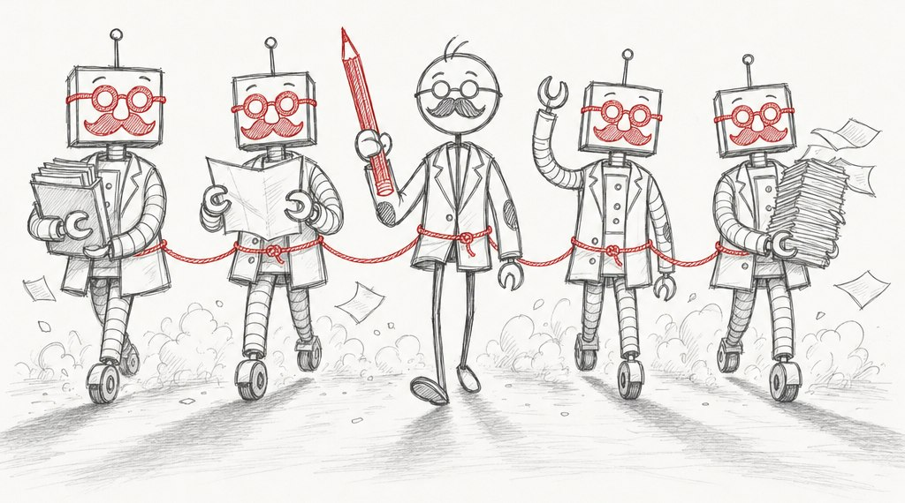
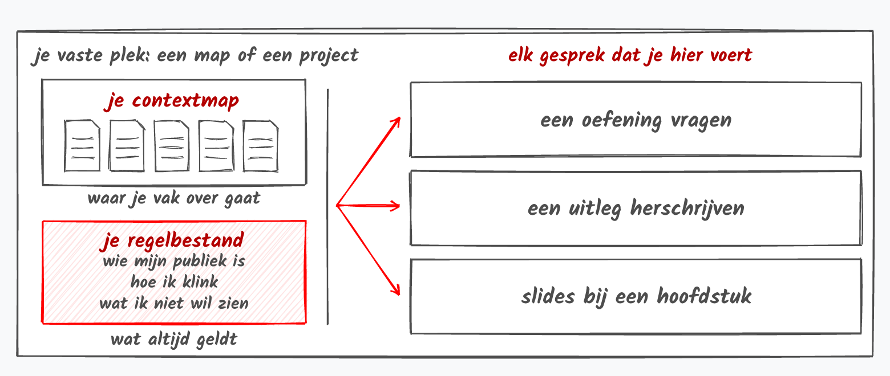

::: {.hero .column-page}


::: {.hero-tekst}
[Jij houdt het touw vast]{.hero-titel}

[AI als extra hulp in je werk, in twee stappen]{.hero-sub}

[Begin bij stap 1](stappen/1-contextmap.qmd){.btn .btn-primary}
:::
:::

Je zat in [de workshop](workshops/index.qmd), of iemand stuurde je deze link. Je gebruikt AI al eens,
of je wil het proberen, voor werk dat je nu al doet: een les voorbereiden, oefeningen maken, je slides
of je cursustekst bijwerken. Deze site gaat over hoe jij daarbij het touw vasthoudt: jij kiest wat de
AI leest, jij schrijft haar afspraken, en jij leest na wat ze maakt.

[**Alles wat je een tweede keer tegen de AI moet zeggen, hoort in een document.**]{.rodedraad}

Vallen er woorden die je niet kent, zoals prompt of agent? Die staan in
[de woordenlijst](woordenlijst.qmd), telkens met een voorbeeld.

## Zeg hoe je AI gebruikte

We vragen het van onze studenten, dus we doen het zelf ook. Zet onder een hoofdstuk, een opgave of je
slides een korte zin met drie dingen: welke tool, waarvoor, en wie het nakeek.

```{.kopieer}
Voor dit hoofdstuk gebruikte ik Microsoft 365 Copilot om mijn slides om te zetten naar tekst en om oefeningen voor te stellen. Ik heb alles nagelezen en aangepast. De inhoud en de fouten zijn van mij.
```

Deze site doet het ook: in [de colofon](colofon.qmd) staat hoe ze gemaakt is.

## Welke AI gebruik je?

Klik op de tool die je school aanbiedt. Werkt je school met Microsoft 365, kies dan Copilot, ook als je
thuis ChatGPT gebruikt. De site onthoudt je keuze: op elke pagina staat daarna het klikpad voor jouw venster
open.

::: {.panel-tabset group="tool"}

## Copilot

Copilot van Microsoft, aangemeld met je school- of werkaccount. Met een gewoon schoolaccount heet hij
*Copilot Chat*, met de betalende licentie *Microsoft 365 Copilot*: voor de twee stappen volstaan
allebei. AP Hogeschool raadt hem aan, ook voor het middelbaar. Je werkt in een
[notebook](woordenlijst.qmd#notebook) (in een Nederlandstalige Copilot: notitieblok). Daar blijven je
documenten en je afspraken staan tussen twee gesprekken.

## ChatGPT



## Gemini



## Claude



:::

## Voor je begint

Maak eerst zelf een ruwe inhoudstafel, en schrijf een stuk van je favoriete hoofdstuk. Begin je met de
AI, dan kiest zij de richting en de toon, en die zijn platgereden.

## De twee stappen

Onder elke stap staat wat je moet klikken in jouw venster, een lijst om af te vinken, en een blok
*Kijk na*. De AI zegt nooit dat ze het niet zeker weet.

::: {.stappen .column-page}

::: {.stapkaart}
[1]{.nr}[instap]{.moeite}

{fig-alt="Tekening van één groot document dat in stukken geknipt wordt: een map per hoofdstuk, een document per onderwerp."}

[Je map]{.stapkop}

Jij bepaalt wat de AI weet: je cursus, geknipt per onderwerp, en je achtergrond: wat een collega nodig
heeft om je vak over te nemen.

[Naar stap 1](stappen/1-contextmap.qmd){.stretched-link .naar}
:::

::: {.stapkaart}
[2]{.nr}[een trapje hoger]{.moeite}

{fig-alt="Tekening van je map en je afspraken op één vaste plek, met pijlen naar elk gesprek dat je daar voert."}

[Je afspraken]{.stapkop}

Jij bepaalt hoe de AI werkt: je toon, wat je nooit wil zien, en wat elk document in je map is. In één
document dat ze bij elke vraag leest.

[Naar stap 2](stappen/2-regelbestand.qmd){.stretched-link .naar}
:::

::: {.stapkaart .gevorderd}
[+]{.nr}[ohja, voor gevorderden]{.moeite}

{fig-alt="Tekening van drie regels over dezelfde taak die van de verbeterlijst naar een eigen werkwijze verhuizen."}

[Recepten voor gevorderden]{.stapkop}

Werken stap 1 en 2 bij jou, kijk dan zeker eens hiernaar: een verbeterlijst, vaste werkwijzen,
kaartjes bij je kernbegrippen, je cursus als website, en kennisclips.

[Naar de recepten](gevorderden/index.qmd){.stretched-link .naar}
:::

:::

## Waar je naartoe werkt

In de galerij staan cursussen van collega's die zo gemaakt zijn, tips van collega's die na de workshop
aan de slag gingen, en de resources die je erbij nodig hebt: de handleidingen van Copilot, de tools voor
je figuren, en voor gevorderden een verzameling vaste werkwijzen van anderen.

[Naar de galerij](galerij/index.qmd){.btn .btn-primary}
