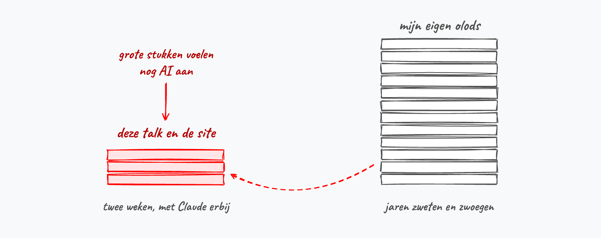
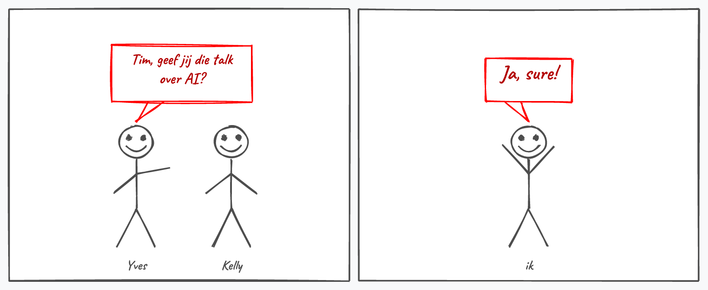
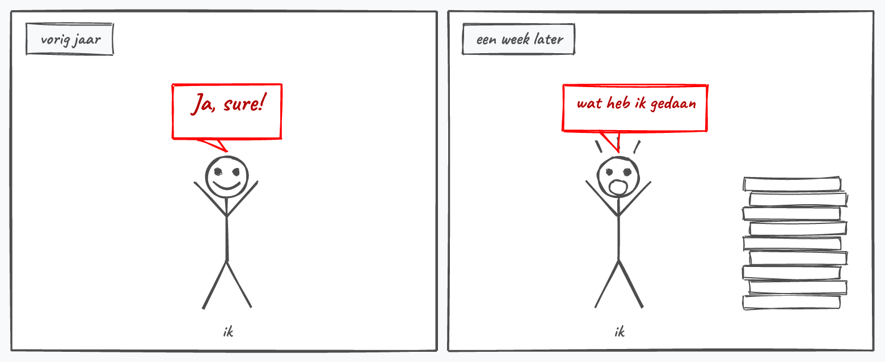
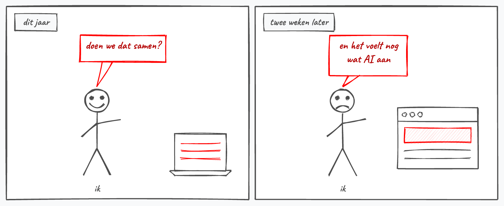
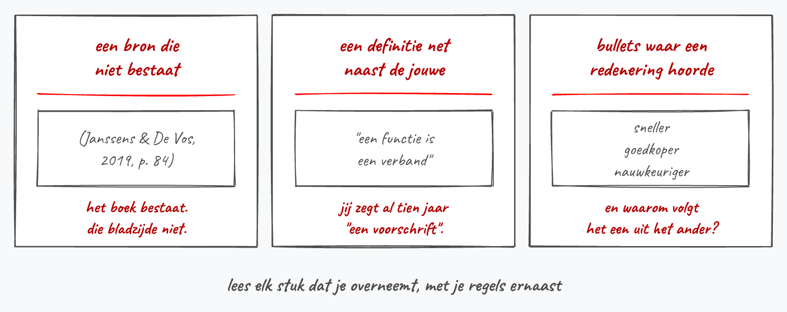

## Waarom ik meteen ja zei

<!-- ORIGIN STORY, VERSIE A: kort, twee slides. Verderop staat versie B,
     dezelfde beats als strip over vier slides. Ze staan er allebei in zodat je
     kan kiezen; voor je presenteert gooi je een van de twee blokken weg.
     Let op: commentaar boven een kop maakt een lege slide, dus het staat er
     bewust onder. -->

::: {.columns}
::: {.column width="55%"}
::: {.terzijde}
Yves en Kelly vroegen me deze talk twee weken geleden. Ik zei meteen ja.
:::

Vorig jaar had ik dat ook gezegd, met een knoop in mijn maag, en een week later
had ik door dat ik mezelf in de voet had geschoten.

Deze keer niet. Deze slides en die site heb ik samen met Claude gemaakt.
:::

::: {.column width="45%"}
{.figuur}
:::
:::

## Het prille begin {.metonder}

{.figuur}

::: {.onder}
Wat ik straks uitleg, heb ik op de rechterstapel geleerd.
:::

## Of hetzelfde, getekend {.tussentitel .center}

<!-- ORIGIN STORY, VERSIE B: dezelfde twee weken als strip, vier slides, tot en
     met "Waar het nu staat". Vervangt de twee slides hierboven. De strips komen
     uit assets/imagegen/strip-*.js, met de figuurtjes en ballonnen in strip.js. -->

::: {.terzijde}
Vier plaatjes, dezelfde twee weken.
:::

## De vraag {.metonder}

{.figuur}

::: {.onder}
Yves en Kelly leiden de opleiding. Zij vroegen, en ik antwoordde binnen de seconde.
:::

## Vorig jaar ging dat zo {.metonder}

{.figuur}

::: {.onder}
Hetzelfde antwoord, en daarna het besef dat er niets klaarlag.
:::

## Dit jaar ging het anders {.metonder}

{.figuur}

::: {.onder}
De site staat er, en deze slides ook. Ze klinken nog niet als ik.
:::

## Waar het nu staat

::: {.columns}
::: {.column width="46%"}
{.figuur}
:::

::: {.column width="54%"}
[De kleine rode stapel]{.kop} is deze talk en die site. Twee weken oud, en dat
hoor je.

[De grote stapel]{.kop} zijn mijn eigen olods. Daar zit alles in wat ik straks
uitleg, en daar zijn jaren in gekropen.

::: {.onder style="text-align:left"}
De voet geneest wel.
:::
:::
:::

## Zo is het bij bijna iedereen begonnen {.metonder}

{.figuur}

::: {.onder}
Eén zin in een leeg venster. Wat eruit kwam, kon van eender wie zijn.
:::

## Het lag niet aan je vraag

::: {.terzijde}
Prompten is het stuk waar iedereen het over heeft.
:::

Het is een tiende van het werk.

De rest is het opschrijven van wat jij al twintig jaar weet en nergens hebt
staan: hoe je klinkt, hoe je een hoofdstuk opbouwt, wat je nooit wil zien.

::: {.kader}
Daarom gaat het hierna over een volgorde, en niet over zinnen die je moet typen
of knoppen die je moet vinden. Waar je moet klikken staat per tool op de site.
:::

## De volgorde {.metkolommen}

{.figuur}

::: {.columns}
::: {.column width="50%"}
[Eén en twee]{.kop} gaan nog niet over AI. Het is het schrijverswerk dat je ook
zonder chatvenster zou doen, en het is precies waarom ze eerst staan.
:::

::: {.column width="50%"}
[Drie tot zes]{.kop} zijn de vier dingen die het verschil maken zodra de AI erbij
komt. Zeven is je opmaak, en die staat achteraan omdat alles ervoor nog verandert.
:::
:::

## [1]{.nr} Schrijf eerst als schrijver {.metonder}

{.figuur}

::: {.onder}
Vraag je meteen een hoofdstuk, dan krijg je twaalf hoofdstukken die elk apart
kloppen en samen nergens naartoe gaan.
:::

## [2]{.nr} Zet je cursus in droge tekst {.metonder}

{.figuur}

::: {.onder}
Markdown of gewone txt. Een map per hoofdstuk, daarin een bestand per onderwerp.
En trek je nog niets aan van je opmaak: die is stap zeven.
:::

## [3]{.nr} Maak een contextmap, en hou ze sec {.metonder}

{.figuur}

::: {.onder}
Elk document dat er zonder reden bij komt, maakt de andere minder zwaar.
:::

## [4]{.nr} Zet je regels in een bestand {.metonder}

{.figuur}

::: {.onder}
`claude.md`, `gemini.md`, of de projectinstructie in je venster.
:::

## [5]{.nr} Laat de AI bijhouden wat je corrigeert {.metonder}

{.figuur}

::: {.onder}
Alles wat je een derde keer corrigeert, is een afspraak die je nooit hebt
opgeschreven.
:::

## En daar komen je skills uit {.metonder}

{.figuur}

::: {.onder}
Figuren, oefeningen, examenvragen: elke taak die terugkeert.
:::

## [6]{.nr} Kijk na {.metonder}

{.figuur}

::: {.onder}
De AI zegt nooit dat ze het niet zeker weet.
:::

## [7]{.nr} En dan pas je opmaak {.metonder}

{.figuur}

::: {.onder}
Nu verandert er aan de tekst niets meer, dus nu mag de opmaak. Wie ze eerst deed,
doet ze opnieuw bij elke zin die daarna nog veranderde.
:::

## Twee dingen die ernaast lopen

::: {.columns}
::: {.column width="50%"}
[Je afbeeldingen]{.kop}

Schrijf per figuur één zin op over wat erop moet staan. Waarmee je ze maakt,
beslis je later.

::: {.onder style="text-align:left"}
De tekeningen hier zijn Excalidraw-code. Ze zitten in git, en ik kan er een
woord in wijzigen zonder opnieuw te tekenen.
:::
:::

::: {.column width="50%"}
[Git]{.kop}

Staan je bestanden op je eigen schijf, zet er dan versiebeheer op vanaf de
eerste dag.

::: {.onder style="text-align:left"}
Blijf je in de browser werken, dan sla je dit over.
:::
:::
:::

## Je eerste sessie

1. Kies één hoofdstuk. Dat waar je zelf het minst tevreden over bent.
2. Maak de map, zet je regels erin, zet je contextmap ernaast.
3. Vraag één ding: *herschrijf sectie 2 met mijn regels ernaast*.
4. Lees na, corrigeer, en laat elke correctie in `improve.md` zetten.

::: {.kader}
Je stopt wanneer dat ene hoofdstuk er staat zoals jij het wil. De andere twaalf
blijven ondertussen gewoon liggen.
:::

## Nog eens, in volgorde {.metonder}

{.figuur}

::: {.onder}
Begin bij één, en niet bij drie.
:::

## De site {.tussentitel .center}

::: {.terzijde}
Werk in uitvoering, en dat is geen bescheidenheid.
:::

## Vier delen {.metonder}

{.figuur}

::: {.onder}
Onder elke voorbeeldkaart staan bolletjes met de techniek erachter. Staat er
*markdown*, dan was de tekst het werk en kwam de site er achteraf uit.
:::

## Hoe je hem gebruikt

**De startpagina** geeft het antwoord op "hoe begin ik eraan": dezelfde zeven
stappen, in dezelfde volgorde.

**De bevrager** vraagt welke AI je hebt en wat je al kan, en geeft je jouw plan.
Claude, ChatGPT, Gemini, Copilot, iets zelfgehost, of nog geen abonnement.

**Het naslagwerk** is om later in terug te vallen. De valkuilen staan er op
klacht: je typt wat er misgaat, en je krijgt de stap die je oversloeg.

**De voorbeelden** zijn tien cursussen en sites van collega's, met bij elk wat
het is en waarmee het gebouwd is. Zie Scherp Scherper staat er ook tussen.

## Waar je moet klikken {.metonder}

{.figuur}

::: {.onder}
Deze talk ging over de volgorde. Dit is wat er niet in past, en precies wat de
site wel doet: kies je tool, en elke pagina zegt hoe het bij jou heet.
:::

## Wat er nog niet af is

- De galerij groeit nog. Ken je een cursus, site of cursusmap die erin hoort,
  laat het weten.
- Grote stukken van de teksten voelen nog AI aan. Dat is wat ik in het begin
  over deze slides zei, en het geldt ook voor de site.
- Of de bevrager de juiste vragen stelt, weet ik niet. Dat merk ik pas wanneer
  iemand anders hem doorloopt met zijn eigen vak in zijn hoofd.

::: {.kader}
Ga naar `timdams.github.io/websiteCursusAISchrijven`, doorloop de bevrager met
je eigen vak in je hoofd, en stuur me terug waar je vastliep of wat er ontbreekt.
:::
