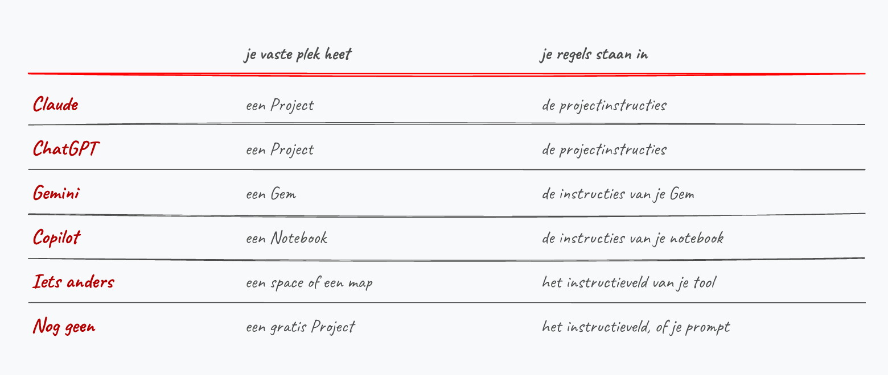

## Waar deze talk begint {.metonder}

{.figuur}

::: {.onder}
Alles wat volgt is proefondervindelijk gevonden. Roep wanneer iets niet klopt. Mensen helemaal rechts: ik reken op **feedback**.
:::

---

## Waar deze talk begint {.metonder}

{.figuur}

::: {.onder}
Ah ja. En Kristof.
:::

---

## Waarom ik meteen ja zei

::: {.terzijde}
Yves en Kelly vroegen 2 weken geleden op overleg of ik deze talk wou geven...Ik zei direct 'ja'.
:::

::: {.columns}
::: {.column width="50%"}
[Tim from the past]{.kop}

Had dat ook geantwoord. En week later diiiik spijt van gehad.
:::

::: {.column width="50%" .fragment}
[Tim van nu]{.kop}

Zei ja , had uur later een outline en 1 dag en 3 prompts later  een eerste cursusversie die online beschikbaar was. 
:::
:::

## Fair warning {.metnaast}

::: {.columns}
::: {.column}
{.figuur}
:::

::: {.column}
[De kleine rode stapel]{.kop} = deze talk en een website:

* Twee weken werk, en dat
hoor/zie/lees je. 
* *(Kon deze zin nog meer A.I. aanvoelen?)*

[De grote stapel]{.kop} = mijn eigen olods (insert sluikreclame voor Zie Scherp Scherper, hier):

* Lees: vele jaren werk, recyclage, ervaring en feedback.

::: {.onder style="text-align:left"}
De voet geneest wel. *(wederom zo'n typische A.I.-zin)*
:::
:::
:::

## Onze eerste stapjes. Remember? {.metonder}

{.figuur}

::: {.onder}
**Gevaar van A.I. is dat het altijd overtuigend antwoordt.**
:::

## Het lag niet alleen aan je prompt

::: {.columns}

::: {.column width="46%"}


::: {.terzijde}
Prompten is al lang niet meer de *core competentie*.
:::

Akkoord, het start bij je prompt, maar veel belangrijker zijn je **ervaring en stijl als
lesgever**.

En hoe kan A.I. dat overnemen?!


:::


::: {.column width="54%"}
{.figuur}


:::
:::
::: {.kader .fragment}
Wat volgt is daarom een voorgestelde workflow (en een website  praktische tools en tips).
:::

## De workflow {.metkolommen}

{.figuur}

::: {.columns}
::: {.column width="50%"}
[Eén en twee]{.kop} is zonder A.I (sorry!).
:::

::: {.column width="50%"}
[Drie tot 7]{.kop} is waar A.I. je leven fijner zal maken  😉.
:::
:::

## [1]{.nr} Schrijf eerst als schrijver {.metonder}

{.figuur}

::: {.onder}
Outline, eerste versie, nalezen, herschrijven: die volgorde verandert niet omdat
er een AI bij komt. Vraag je meteen een hoofdstuk, dan krijg je twaalf
hoofdstukken die elk apart kloppen en samen nergens naartoe gaan.
:::

## [2]{.nr} Zet je cursus in droge tekst {.metonder}

{.figuur}

::: {.onder}
Markdown of gewone txt. Een map per hoofdstuk, daarin een bestand per onderwerp.
En trek je nog niets aan van je opmaak: die is stap zeven.
:::

## [3]{.nr} Maak een contextmap, en hou ze proper {.metonder}

{.figuur}

::: {.onder}
`context/`:hierin zit wat een collega nodig heeft om je vak over te nemen. *K.I.S.S.* 

`content/`: Hier komen je cursushoofdstukken (later afbeeldingen.
:::

## [4]{.nr} Zet je regels in een bestand: de handleiding voor je agents {.metonder}

{.figuur}

::: {.onder}
`claude.md`, `gemini.md`, of de projectinstructie in je venster. In datzelfde
bestand zet je per document van je contextmap die ene regel waarom. 
:::

## Wat zet je daar dan in?

::: {.terzijde}
Een tekstbestand van een halve pagina, in de map van je cursus. Je AI leest het
bij elke nieuwe vraag opnieuw, zonder dat jij het meestuurt.
:::

* **Je toon.** Beschrijf die niet zelf: *"vlot en toegankelijk"* levert precies
  niks op. Geef twee eigen teksten en vraag welke regels die volgen.
* **Je niet-doen-lijst.** Die weegt zwaarder dan de wel-doen-lijst. Daaraan
  herkent een lezer AI-tekst (maar je zal het nooit helemaal wegkrijgen...trust me).
* **Je contextmap.** Een "plan" van je folder. Waar staat welk bestand en waarvoor dient het.

::: {.kader}
Werk je in een chatvenster, dan is dit het instructieveld van je project. 
:::

## Voorbeeldje

```markdown
## Toon
- Vlaams, je-vorm, korte zinnen.
- Vet is voor de zin die je in de les twee keer zou zeggen.

## Niet doen
- Geen em-dashes. Een dubbele punt of een nieuwe zin.
- Geen wijze slotzin: stop na het laatste feit.
- Getallen tot twintig voluit.

## Mijn contextmap
- `toonvoorbeeld.md`: mijn hoofdstuk over casting. Hier zit mijn stem in.
- `gettingstarted.md`: de huisregels waar deze talk uit komt.
```

::: {.onder style="text-align:left"}
* Maak elke regel nakijkbaar. *Schrijf helder* kan je niet nakijken, *getallen tot
twintig voluit* wel. 
* Laat de A.I. het regelbestand nalezen en er feedback op geven.
:::

## [5]{.nr} Laat de AI bijhouden wat je corrigeert {.metonder}

{.figuur}


## Voorbeeld van mijn regels omtrent afbeeldingen maken {.metnaast}

::: {.columns}
::: {.column}
{.figuur}
:::

::: {.column}

* `improve.md` wordt vanaf dan meegelezen zoals je regelbestand zelf: de AI past toe wat ze daar noteerde.
* Beter dan "ik zal op het einde van de sessie al m'n remarks wel even opschrijven"...dat doe je toch nooit.
* Tip: neem de regels geregeld door (soms neemt de A.I. vreemde beslissingen, en dan moet je ze corrigeren).

:::
:::

## En daar komen je 'skills' uit {.metonder}

{.figuur}

::: {.onder}
Figuren, oefeningen, examenvragen: elke taak die terugkeert.
:::

## Wat is zo'n skill dan?

::: {.terzijde}
Een receptenblad voor één taak.
:::

::: {.columns}
::: {.column width="52%"}
Een apart tekstbestand met **de reeks stappen** die de AI telkens opnieuw moet
doen. Bovenaan één regel over wanneer het van toepassing is, en daar herkent ze
het aan.

Wat erin staat:

* de commando's, met de map van waaruit je ze draait
* wat er nagekeken wordt voor het klaar is
* hoe het resultaat moet heten en waar het komt te staan
:::

::: {.column width="48%"}
[Taken waar het loont]{.kop}

* **Een figuur tekenen.** Van het script tot de PNG die ik zelf nog bekijk.
* **Code testen en rapporteren.** `dotnet test` draaien, enkel de gefaalde
  teruggeven, met bestand en regelnummer erbij.
* **Een examenvraag maken.** Vier alternatieven, één juist, geen *alle
  bovenstaande*.
:::
:::

## Voorbeeld Mijn skill voor de illustraties {.metnaast}

::: {.columns}
::: {.column}
{.figuur}
:::

::: {.column}

* Meeste tekeningen in deze talk zijn met deze skills gemaakt.
* Sommige zijn met behulp van ChatGpt Images 2.0 gemaakt.
* Tip: laat je imagegen prompts door de A.I. uitschrijven.

:::
:::

## Wanneer maak je er een?

::: {.terzijde}
Wanneer je jezelf dezelfde reeks commando's hoort dicteren. Bij mij was dat de
derde tekening.
:::

* Merk je dat je agent telkens dezelfde acties doorloopt (dezelfde scripts,
  dezelfde volgorde, dezelfde controle op het einde), dan hoort dat op een blad.
* Vraag het op het einde van die chat: *schrijf wat we net gedaan hebben als een
  skill: de stappen in volgorde, met de commando's en met wat er misliep.*
* Lees na wat ze opschrijft. Bij mij stond er een stap in die ik nooit gevraagd had.

::: {.kader}
Doe dat vóór je het venster sluit. Zij heeft het gesprek nog: welke commando's
er gedraaid zijn, en welke twee keer over moesten. In een nieuw venster is dat
weg.
:::

## [6]{.nr} Kijk na

::: {.terzijde}
De enige stap die je met je eigen ogen doet. Daarom staat die zes gestreept in
het schema en niet vol.
:::

* **De AI zegt nooit dat ze het niet zeker weet.** Een verzonnen jaartal staat er
  even overtuigd als een juist jaartal.
* Zelf lezen dus: de getallen, de namen, de bronnen, en of het klopt met wat jij
  in de les vertelt. Staat er code in, dan draai je ze.
* Wat je hier corrigeert, gaat naar `improve.md` van stap vijf. Anders kijk je
  het volgende hoofdstuk na op precies hetzelfde.

::: {.kader}
[Eén hulpmiddel wel]{.kop}: laat de AI haar eigen tekst nalezen, maar in een
andere rol, en liefst in een ander model dan het model dat ze geschreven heeft.

* *Lees dit hoofdstuk als een student met dyslexie. Waar haak je af?*
* *Stel dat de Spaanse inquisitie mijn cursus leest: welke uitspraken moet ik
  zeker online verifiëren?*
:::

## [7]{.nr} En dan pas je opmaak {.metonder}

{.figuur}

::: {.onder}
Nu verandert er aan de tekst niets meer, dus nu mag de opmaak. Wie ze eerst deed,
doet ze opnieuw bij elke zin die daarna nog veranderde.
:::

## Twee dingen die ernaast lopen

::: {.columns}
::: {.column width="50%"}
[Je afbeeldingen]{.kop}

Schrijf per figuur één zin op over wat erop moet staan. Waarmee je ze maakt,
beslis je later.

::: {.onder style="text-align:left"}
De tekeningen hier zijn Excalidraw-code. Ze zitten in git, en ik kan er een
woord in wijzigen zonder opnieuw te tekenen.
:::
:::

::: {.column width="50%"}
[Git]{.kop}

Staan je bestanden op je eigen schijf, zet er dan versiebeheer op vanaf de
eerste dag.

::: {.onder style="text-align:left"}
Blijf je in de browser werken, dan sla je dit over.
:::
:::
:::

## Je eerste sessie

1. Kies één hoofdstuk. Dat waar je zelf het minst tevreden over bent.
2. Maak de map, zet je regels erin, zet je contextmap ernaast.
3. Vraag één ding: *herschrijf sectie 2 met mijn regels ernaast*.
4. Lees na, corrigeer, en laat elke correctie in `improve.md` zetten.

::: {.kader}
Je stopt wanneer dat ene hoofdstuk er staat zoals jij het wil. De andere twaalf
blijven ondertussen gewoon liggen.
:::

## Nog eens, in volgorde {.metonder}

{.figuur}

::: {.onder}
Begin bij één, en niet bij drie.
:::

## De site {.tussentitel .center}

::: {.terzijde}
Werk in uitvoering, en dat is geen bescheidenheid.
:::

## Vier delen {.metonder}

{.figuur}

::: {.onder}
Onder elke voorbeeldkaart staan bolletjes met de techniek erachter. Staat er
*markdown*, dan was de tekst het werk en kwam de site er achteraf uit.
:::

## Hoe je hem gebruikt

**De startpagina** geeft het antwoord op "hoe begin ik eraan": dezelfde zeven
stappen, in dezelfde volgorde.

**De bevrager** vraagt welke AI je hebt en wat je al kan, en geeft je jouw plan.
Claude, ChatGPT, Gemini, Copilot, iets zelfgehost, of nog geen abonnement.

**Het naslagwerk** is om later in terug te vallen. De valkuilen staan er op
klacht: je typt wat er misgaat, en je krijgt de stap die je oversloeg.

**De voorbeelden** zijn tien cursussen en sites van collega's, met bij elk wat
het is en waarmee het gebouwd is. Zie Scherp Scherper staat er ook tussen.

## Waar je moet klikken {.metonder}

{.figuur}

::: {.onder}
Deze talk ging over de volgorde. Dit is wat er niet in past, en precies wat de
site wel doet: kies je tool, en elke pagina zegt hoe het bij jou heet.
:::

## Ook deze slides {.metonder}

{.figuur}

::: {.onder}
De linkse was tot vandaag slide twee. In punt één ontbrak een werkwoord, en dat
had ik niet gezien.
:::

## Wat er nog niet af is

- De galerij groeit nog. Ken je een cursus, site of cursusmap die erin hoort,
  laat het weten.
- Grote stukken van de teksten voelen nog AI aan, op de site net zo goed als
  hier in de slides.
- Of de bevrager de juiste vragen stelt, weet ik niet. Dat merk ik pas wanneer
  iemand anders hem doorloopt met zijn eigen vak in zijn hoofd.

::: {.kader}
Ga naar `timdams.github.io/websiteCursusAISchrijven`, doorloop de bevrager met
je eigen vak in je hoofd, en stuur me terug waar je vastliep of wat er ontbreekt.
:::
