## Voor wie is dit? {.metonder}

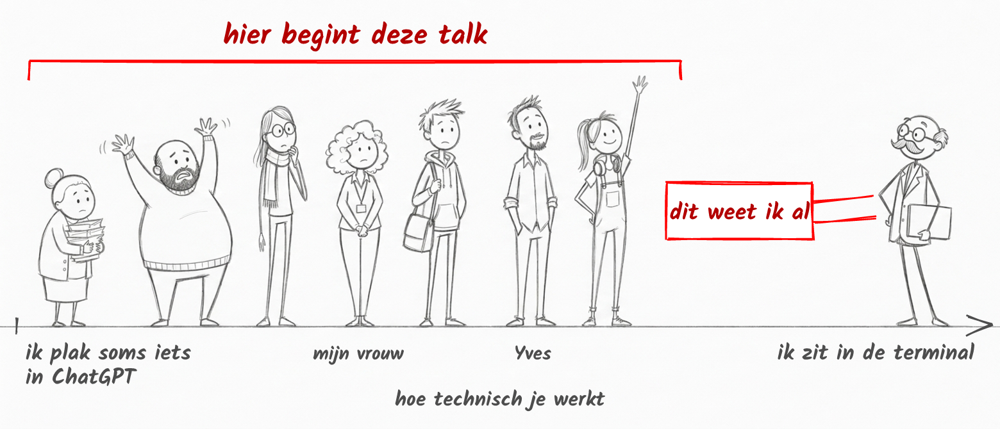{.figuur}

::: {.onder .fragment}
Alles wat volgt is proefondervindelijk gevonden. Roep wanneer iets niet klopt. Mensen helemaal rechts: ik reken op **feedback**.
:::

---

## Voor wie is dit?  {.metonder}

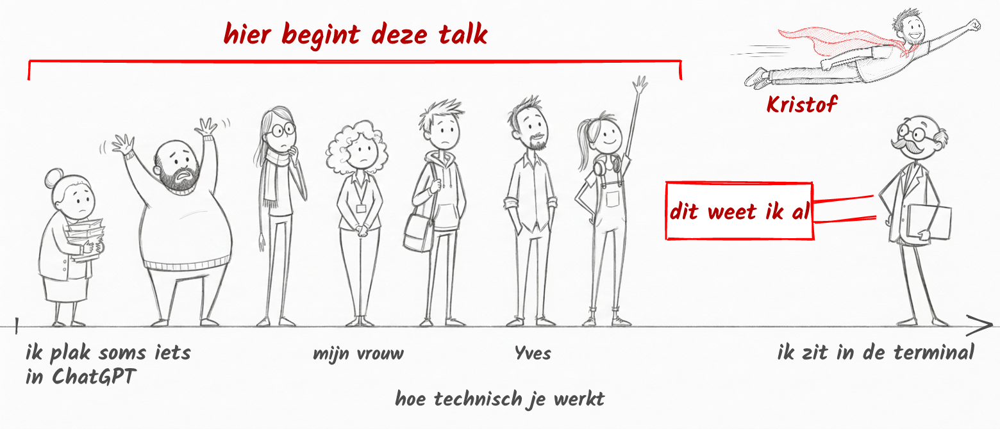{.figuur}

::: {.onder}
Ah ja. En Kristof.
:::

---

## Origin story

::: {.terzijde}
Yves en Kelly vroegen 2 weken geleden op overleg of ik deze talk wou geven...uiteraard zei ik direct 'okidoki!'
:::

::: {.columns}
::: {.column width="50%" .fragment}
[Tim from the past...]{.kop}

...had dat ook geantwoord. En week later diiiik spijt van gehad.
:::

::: {.column width="50%" .fragment}
[Tim van nu...]{.kop}

...zei dus ja , had een uur later een outline en 1 dag en 3 prompts later een eerste cursusversie die online beschikbaar stond. 

Toegegeven, het trok op niets: maar er was tenminste een basis.
:::
:::


## Onze eerste stapjes. Remember? {.metonder}

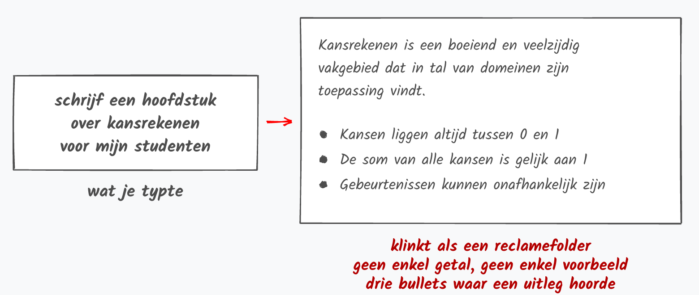{.figuur}

::: {.onder .fragment}
**Gevaar van A.I. is dat het altijd overtuigend antwoordt.**
:::

## Het lag niet alleen aan je prompt

::: {.columns}

::: {.column width="46%"}


::: {.terzijde}
Prompten is al lang niet meer de *core competentie*.
:::

Akkoord, het start bij je prompt, maar veel belangrijker zijn je **ervaring en stijl als
lesgever**.

En hoe kan A.I. dat overnemen?!

Wij zijn toch uniek. Niet vervangbaar.

Toch?

[Toch...?]{.klein}


:::


::: {.column width="54%"}
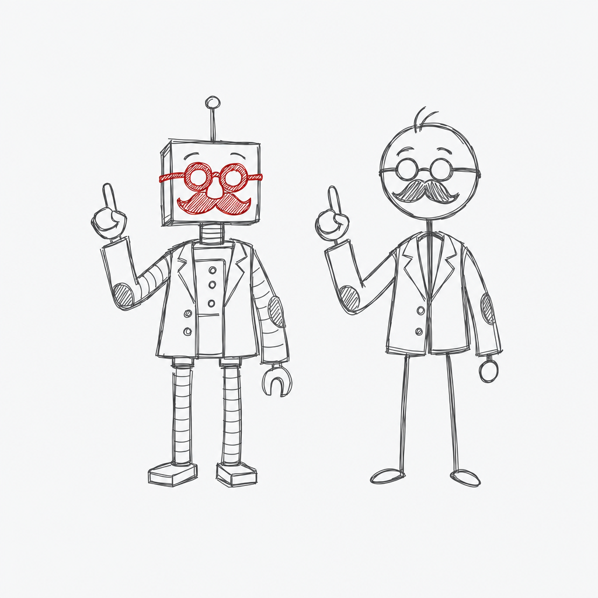{.figuur}


:::
:::
::: {.kader .fragment}
Wat volgt is daarom een voorgestelde workflow (en een work-in-progress website met tips&tricks).
:::

##  A.I. agnostisch...geprobeerd  {.metonder}

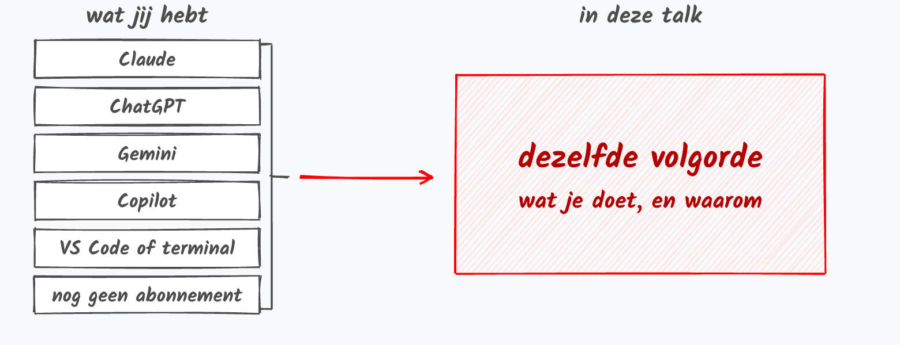{.figuur}

::: {.onder}
Iedereen zit met een ander abonnement (of geen) en een andere toolset: browser,
client, VS Code. Theoretisch werkt wat volgt op elke combinatie. 🤞

:::


## De workflow {.metkolommen}

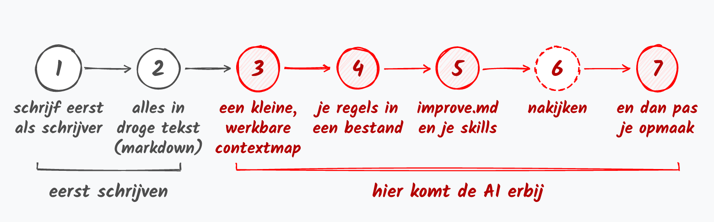{.figuur}

::: {.columns}
::: {.column width="50%"}
[Eén en twee]{.kop} is grotendeels zonder A.I. (sorry!).
:::

::: {.column width="50%"}
[Drie tot 7]{.kop} is waar A.I. je leven fijner zal maken  😉.
:::
:::


## [1]{.nr} Schrijf eerst als schrijver {.metonder}

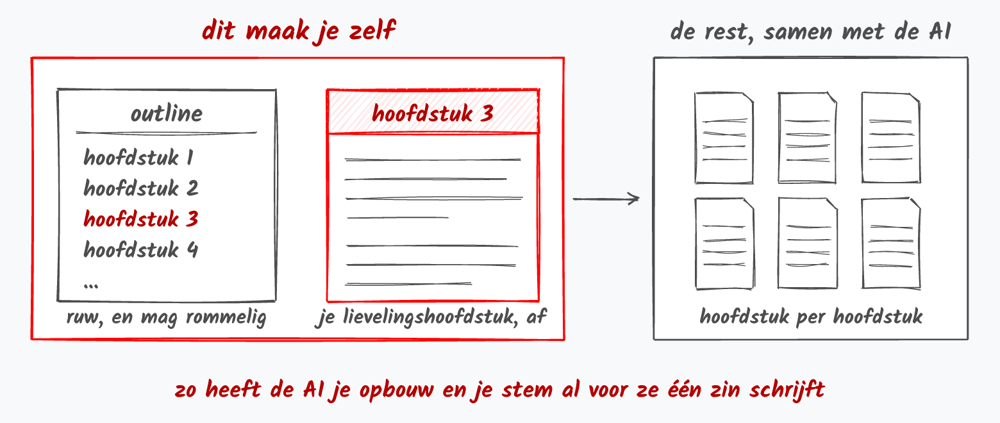{.figuur}

::: {.onder}
Maak een ruwe outline en schrijf (een stuk) van je favoriete hoofdstuk. 

Als je A.I. vanaf nul laat schrijven dan duwt hij de inhoud en toon. **Stay in control 🤓 !**
:::

## [2]{.nr} Zet je cursus in droge tekst {.metonder}

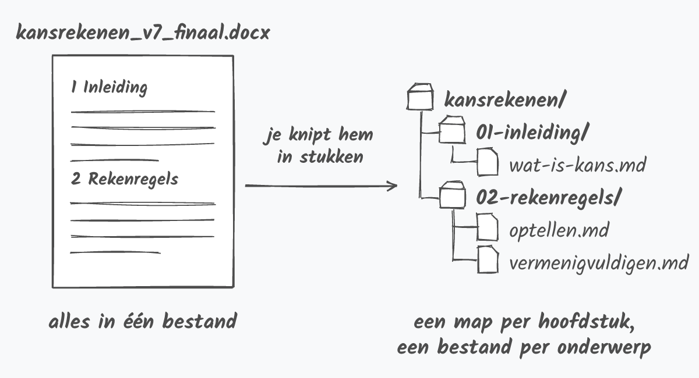{.figuur}

::: {.onder}
**Markdown** of gewone txt. Knip tot op de maat die je in één keer meegeeft: meestal één onderwerp.
En **trek je nog niets aan van je opmaak en afbeeldingen**.
:::

## Tijd om de A.I. te temmen {.metonder}

{.figuur}


## [3]{.nr} Maak een contextmap, en hou ze proper {.metonder}

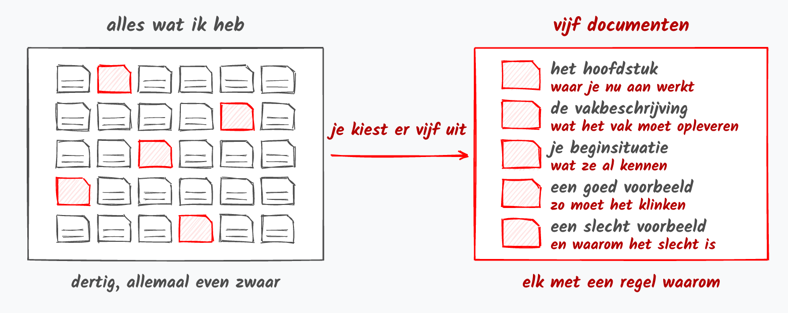{.figuur}

::: {.onder}
`context/`: hierin zit wat een collega nodig heeft om je vak over te nemen. *K.I.S.S.*

`content/`: hier komen je cursushoofdstukken, en later je afbeeldingen.
:::


## [4]{.nr} Zet je regels in een bestand: de handleiding voor je agents {.metonder}

{.figuur}


## [4]{.nr} Regelbestand inhoud?  {.metnaast}

::: {.columns}
::: {.column}
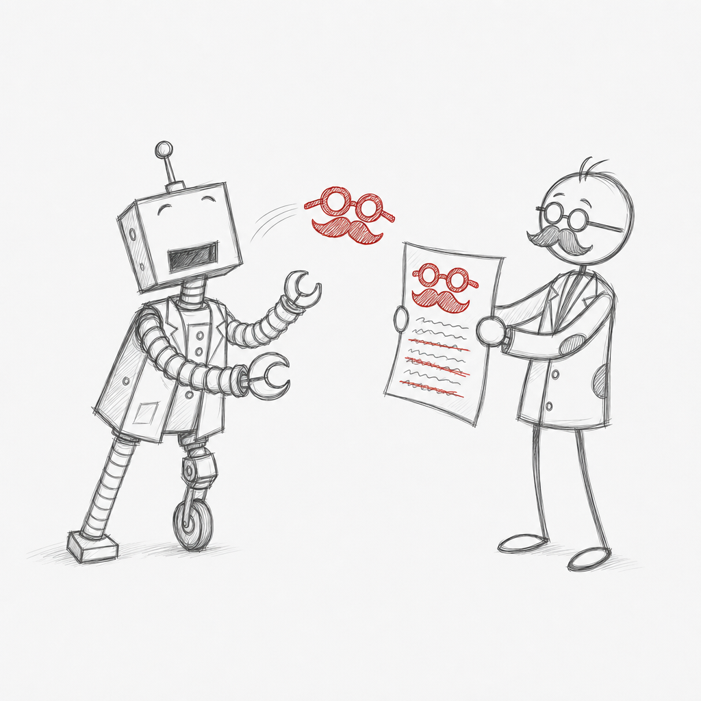{.figuur}
:::

::: {.column}
Een tekstbestand van een halve pagina dat je A.I. bij elke nieuwe vraag opnieuw leest.

Zet er alles dat je telkens opnieuw moet zeggen (alsof het een student is 😉)

Zet er zeker waar alle bestanden staan en wat hun nut is.

[Vergelijk het met een studiewijzer.]{.klein}

:::
:::

## [4]{.nr} Regelbestand voorbeeldje

```markdown
## Toon
- Vlaams, je-vorm, korte zinnen.
- Vet is voor de zin die je in de les twee keer zou zeggen.

## Niet doen
- Geen em-dashes. Een dubbele punt of een nieuwe zin.
- Geen wijze slotzin: stop na het laatste feit.
- Getallen tot twintig voluit.

## Mijn contextmap
- `toonvoorbeeld.md`: mijn hoofdstuk over casting. Hier zit mijn stem in.
- `gettingstarted.md`: de huisregels waar deze talk uit komt.
```

::: {.onder style="text-align:left"}

* Tip: Laat de A.I. het regelbestand nalezen en er feedback op geven.
:::

## "Ja maar, ik werk in een chatvenster..." (Claude vb.) {.metnaast}

::: {.columns}
::: {.column}
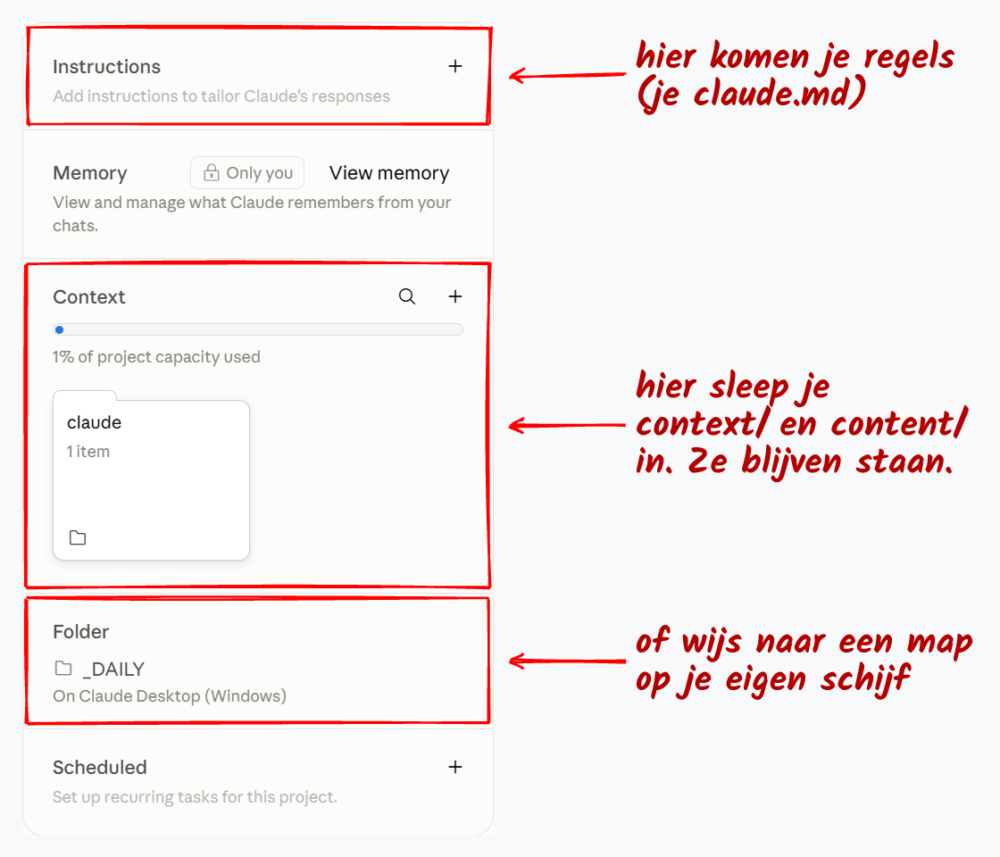{.figuur}
:::

::: {.column}


::: {.kader}
ChatGPT heeft Projects met dezelfde velden, Copilot heeft notebooks. Zoek in
jouw venster waar je bestanden blijven staan.
:::

:::
:::


## [5]{.nr} Laat de A.I. bijhouden wat je corrigeert {.metonder}

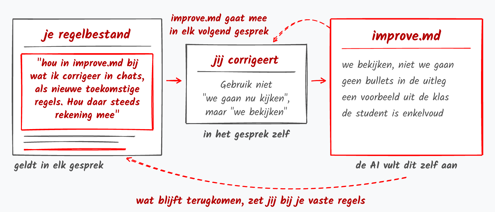{.figuur}


## [5]{.nr} Van losse correcties naar één checklist {.metnaast}

::: {.columns}
::: {.column}
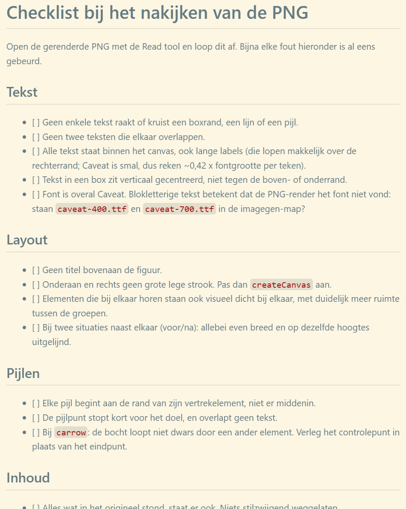{.figuur}
:::

::: {.column}

* Elke regel hier stond eerst als correctie in een chat.
* `improve.md` wordt vanaf dan meegelezen zoals je regelbestand zelf: de A.I. past toe wat ze daar noteerde.
* Beter dan *"ik zal op het einde van de sessie al m'n remarks wel even opschrijven"*...dat doe je toch nooit.😒
* Tip: neem de regels geregeld door (soms neemt de A.I. vreemde beslissingen, en dan moet je ze corrigeren).

:::
:::

## [5]{.nr} En daar komen je '.skills' uit {.metonder}

{.figuur}

::: {.onder}
Figuren, oefeningen, examenvragen: elke taak die terugkeert.
:::

## [5]{.nr} Hoe werkt zo'n skill? {.metonder}

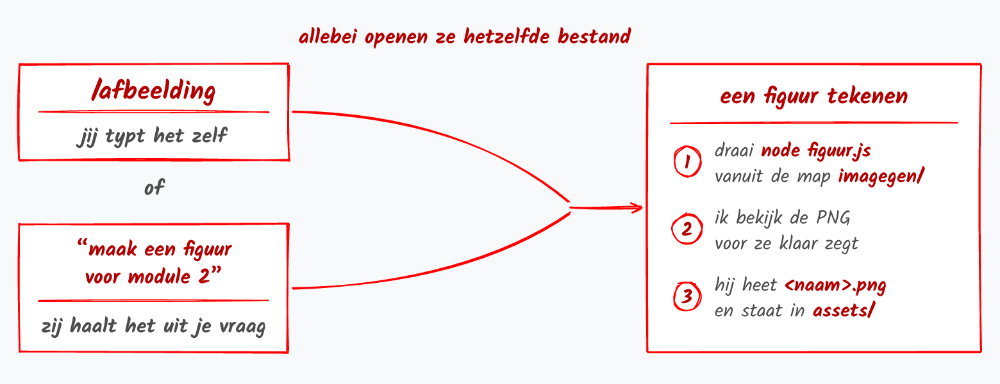{.figuur}

::: {.onder}
Een gewoon tekstbestand dat je zelf schrijft: het **recept** voor die ene taak.


:::

## [5]{.nr} Voorbeeld van mijn skill voor de illustraties {.metnaast}

::: {.columns}
::: {.column}
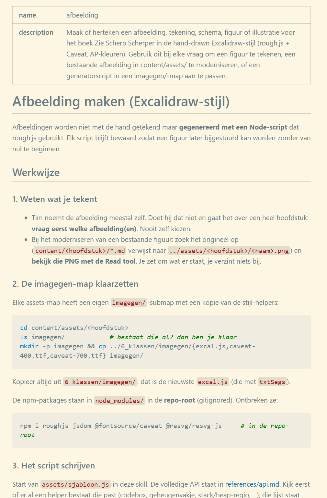{.figuur}
:::

::: {.column}

* Meeste tekeningen in deze talk zijn met deze skills gemaakt.
* Sommige zijn met behulp van ChatGpt Images 2.0 gemaakt.
* Tip: laat je imagegen prompts door de A.I. uitschrijven.


::: {.fragment}
A propos: stap 5 van deze skill is: 

*"Deze stap nooit overslaan. Bekijk de gerenderde PNG met de Read tool. rough.js geeft geen foutmelding bij lelijke
output, dus je moet echt kijken. Loop de checklist in
`references/checklist.md` af, corrigeer het script en render
opnieuw tot het klopt."*


:::


:::
:::

## [5]{.nr} Wanneer maak je een skill, en typ je die zelf? {.metnaast}

::: {.columns}
::: {.column}
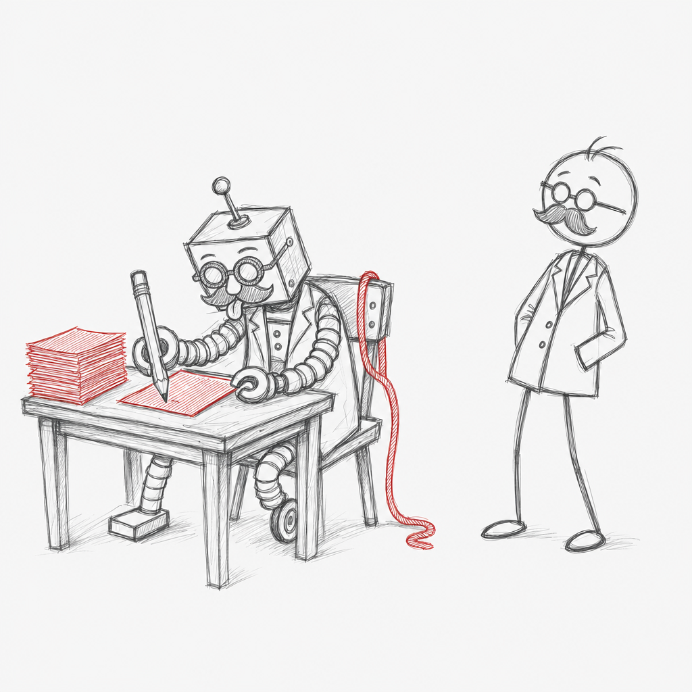{.figuur}
:::

::: {.column}

::: {.terzijde}
Wanneer je jezelf dezelfde reeks commando's hoort dicteren. Of A.I. telkens het wiel moet heruitvinden.
:::

* Skills schrijf je niet zelf...Allez, ik toch niet.
* Vraag het op het einde van een chat: "*schrijf wat we net gedaan hebben als een
  skill: de stappen in volgorde, met de commando's en met wat er misliep.*"
* Controleer de skill, en "installeer" hem.


::: {.fragment}
* Tip: installeer niet iedere skill die je online vindt. Broedt op je eigen skills. **Remember: you're the boss! 🧑‍🍳**

:::

:::
:::

## [6]{.nr} Kijk na {.metnaast}

::: {.columns}
::: {.column}
{.figuur}
:::

::: {.column}
::: {.terzijde}
Het verschil tussen een cursus en A.I.-slob.
:::

* **De A.I. zegt nooit dat ze (hij?) het niet zeker weet.**
* Zelf lezen dus: de getallen, de namen, de bronnen, en of het klopt met wat jij
  in de les vertelt. 
* Tokens te veel? Laat A.I. de codevoorbeelden zelf runnen en testen.
* Wat je hier corrigeert, gaat naar `improve.md` van stap vijf.
:::
:::


## [6]{.nr} Huur het A(I)-team {.metnaast}

::: {.columns}
::: {.column}
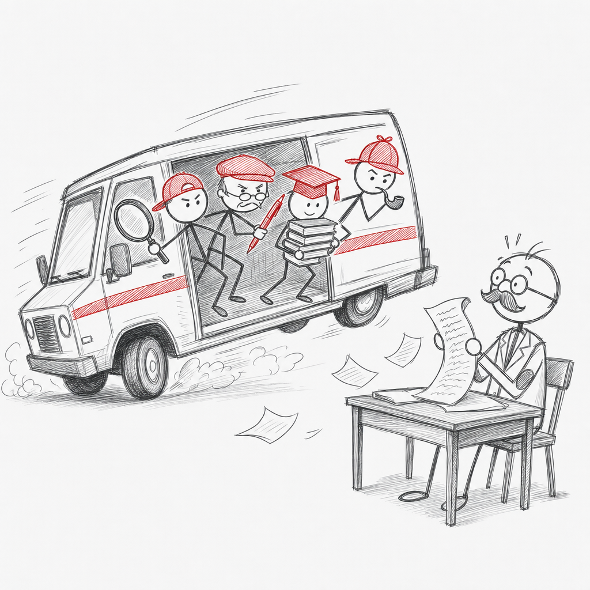{.figuur}
:::

::: {.column}

Laat de A.I. je teksten nalezen, maar telkens in een andere rol.

::: {.kader}
* "*Lees dit hoofdstuk als een student met dyslexie. Waar haak je af?*"
* *"Je bent eindredacteur bij Pearson en wil dit hoofdstuk de finishing touches geven voor je het in miljoenen oplage afdrukt. Waar zitten de easy wins? Wat gaat de uitgeverij geld kosten?"*
* "*Stel dat de Spaanse inquisitie mijn cursus leest: welke uitspraken moet ik
  zeker online verifiëren?*"
:::

:::
:::

## [7]{.nr} En finaal de belekes, pdf, slides, etc! {.metonder}

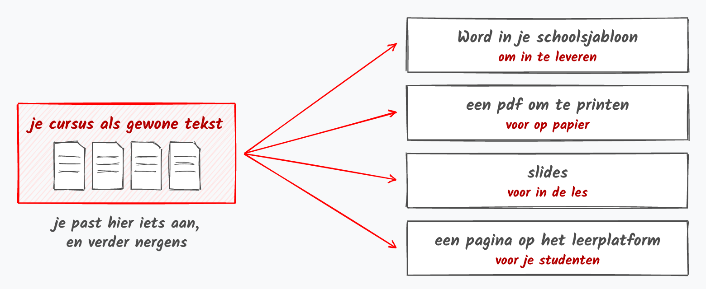{.figuur}

::: {.onder}
Nu begint de tokenburning ... en fun 😁.

Maar dat is voor een andere keer...
:::

## Ook deze slides doorliepen deze flow {.metonder}

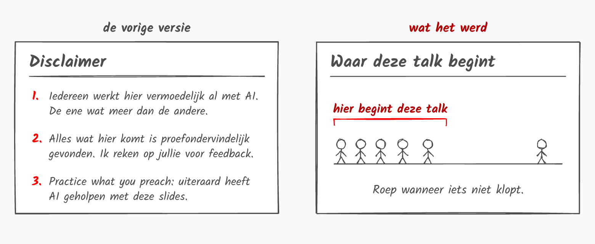{.figuur}

## Deze talk, als map {.metonder}
<!-- SLOT B van twee. A is "Wat je meeneemt" hierboven. Dezelfde vier dingen,
     maar dan waar ze staan in de repo van deze talk zelf. -->

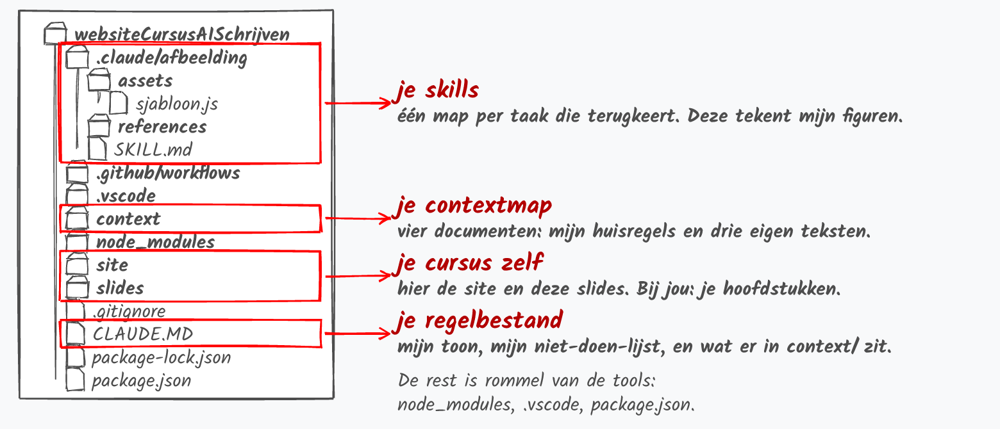{.figuur}


## Wat je (hopelijk) mee naar huis neemt  {.metonder}

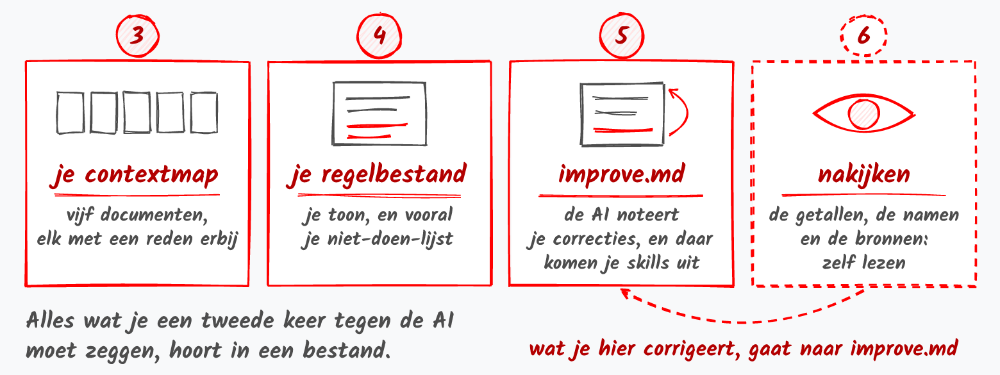{.figuur}


## Hoe heet het bij jou? In je venster

<table class="termen">
<colgroup>
  <col style="width:14%"><col style="width:32%"><col style="width:25%"><col style="width:29%">
</colgroup>
<thead>
<tr>
  <th class="hoek"></th>
  <th>je vaste plek heet</th>
  <th>je regels staan in</th>
  <th>een skill is</th>
</tr>
</thead>
<tbody>
<tr>
  <th>Claude</th>
  <td>een Project</td>
  <td>de projectinstructies</td>
  <td>een Skill, als zip of <code>.md</code> opgeladen</td>
</tr>
<tr>
  <th>ChatGPT</th>
  <td>een Project</td>
  <td>de projectinstructies</td>
  <td>een document in je project, of een eigen GPT</td>
</tr>
<tr>
  <th>Gemini</th>
  <td>een Gem, of een Notebook</td>
  <td>de instructies van je Gem of notebook</td>
  <td>een tweede Gem</td>
</tr>
<tr>
  <th>Copilot</th>
  <td>een Notebook</td>
  <td>de instructies van je notebook</td>
  <td>een tweede notebook</td>
</tr>
</tbody>
</table>

::: {.onder}

Deze info heeft Claude verzameld...Graag feedback (nadien) of dit klopt.
:::


## Hoe heet het bij jou? In een map op je pc

<table class="termen">
<colgroup>
  <col style="width:14%"><col style="width:32%"><col style="width:25%"><col style="width:29%">
</colgroup>
<thead>
<tr>
  <th class="hoek"></th>
  <th>waarmee je je map opent</th>
  <th>je regels staan in</th>
  <th>je skills staan in</th>
</tr>
</thead>
<tbody>
<tr>
  <th>Claude</th>
  <td>de Claude-app<span class="via">Cowork, of Claude Code</span></td>
  <td><code>CLAUDE.md</code></td>
  <td><code>.claude/skills/</code></td>
</tr>
<tr>
  <th>ChatGPT</th>
  <td>Codex<span class="via">in de ChatGPT-app, of in VS Code</span></td>
  <td><code>AGENTS.md</code></td>
  <td><code>~/.codex/skills/</code></td>
</tr>
<tr>
  <th>Gemini</th>
  <td>Antigravity<span class="via">de editor van Google zelf</span></td>
  <td><code>AGENTS.md</code><span class="via">of <code>GEMINI.md</code></span></td>
  <td><code>.agents/skills/</code></td>
</tr>
<tr>
  <th>Copilot</th>
  <td>VS Code<span class="via">niet de Copilot in Word</span></td>
  <td><code>AGENTS.md</code></td>
  <td><code>.github/skills/</code></td>
</tr>
</tbody>
</table>

::: {.onder}

Drie van de vier lezen AGENTS.md, en in elke skills-map zit een SKILL.md.
:::


## Ohja...de site {.tussentitel .center}

::: {.terzijde}
Op vraag van mijn vrouw...en Yves 😉
:::

## Vier delen {.metonder}

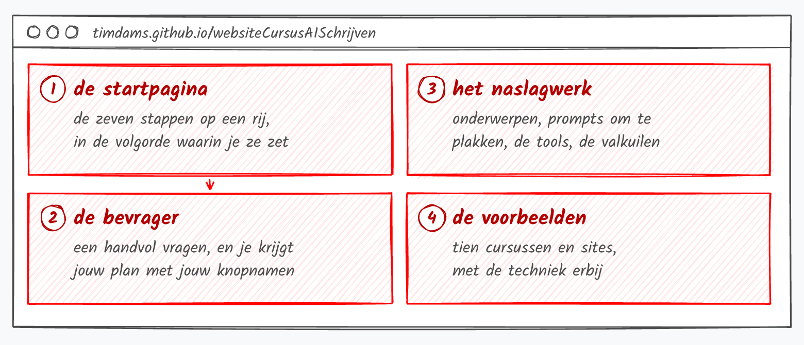{.figuur}


## Wat er nog niet af is

- De galerij groeit nog. Ken je een cursus, site of cursusmap die erin hoort,
  laat het weten.
- Grote stukken van de teksten voelen nog A.I. aan.
- Of de bevrager de juiste vragen stelt, weet ik niet. Dat merk ik pas wanneer
  iemand anders hem doorloopt met zijn eigen vak in zijn hoofd.

:::: {.columns}
::: {.column width="72%"}
::: {.kader}
Ga naar `timdams.github.io/websiteCursusAISchrijven`, doorloop de bevrager met
je eigen vak in je hoofd, en stuur me terug waar je vastliep of wat er ontbreekt.
:::
:::

::: {.column width="28%"}
{.qr}
:::
::::


## Bedankt! {.center}

{.figuur}
